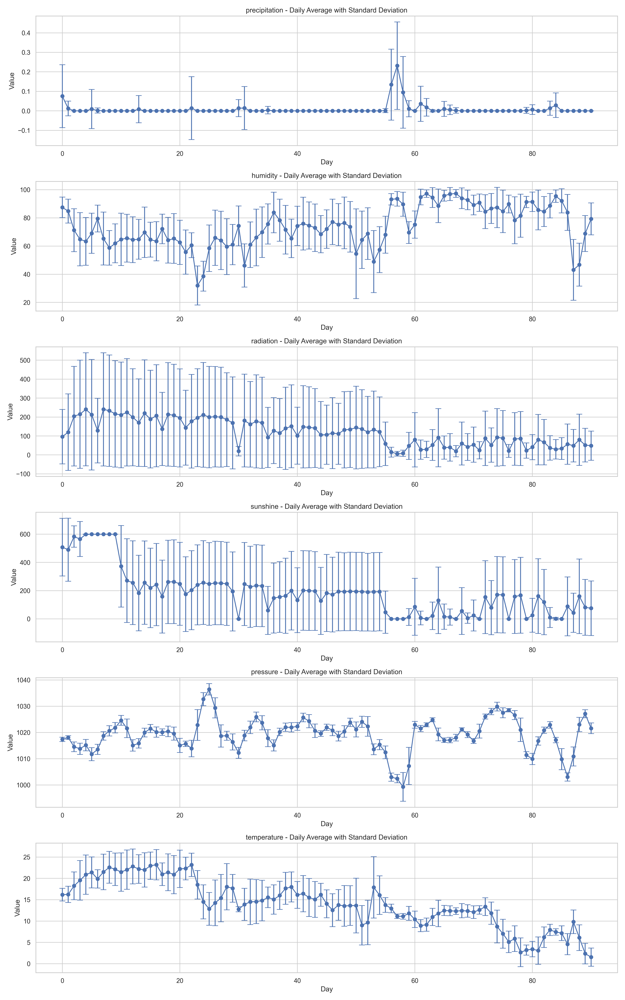

# IoT Data Analysis for Industry 4.0

This project focuses on analyzing IoT data from environmental and traffic sensors to predict traffic patterns using machine learning. The system combines real-time data streaming with historical data analysis to provide insights into traffic behavior based on environmental conditions.

## Project Structure

```
IoT-Data-Analysis/
├── data/                      # Data files
│   ├── environ_MS83200MS_nowind_3m-10min.json
│   ├── traffic_raw_siemens_light-veh.json
│   └── traffic_raw_siemens_heavy-veh.json
├── logs/                      # Log files
├── models/                    # Trained models
├── outputs/                   # Generated outputs
│   └── streaming/            # Real-time analysis results
├── src/                      # Source code
│   ├── data_acquisition.py   # Data loading and preprocessing
│   ├── data_processing.py    # Data processing utilities
│   ├── data_analysis.py      # Data analysis and visualization
│   ├── model_training.py     # Model training and evaluation
│   └── mqtt_streaming.py     # Real-time data streaming
└── requirements.txt          # Project dependencies
```

## Data Sources

### Environmental Data
- **Source**: MS83200MS sensor
- **Format**: JSON
- **Variables**:
  - Temperature (°C): Range 1.54°C to 23.20°C
  - Humidity (%): Range 32.01% to 97.32%
  - Radiation (W/m²): Range 6.04 to 240.73
  - Pressure (hPa): Range 999.27 to 1036.47
  - Sunshine (minutes): Range 0.00 to 599.55
  - Precipitation (mm): Range 0.00 to 0.23

### Traffic Data
- **Source**: Siemens sensors
- **Format**: JSON
- **Categories**:
  - Light vehicles:
    - Mean: 46.06 vehicles
    - Range: 0 to 144 vehicles
    - Zero values: 2303 instances
  - Heavy vehicles:
    - Mean: 3.60 vehicles
    - Range: 0 to 12 vehicles
    - Zero values: 2873 instances
- **Metrics**:
  - Vehicle count per 10-minute interval
  - Timestamp-based measurements
  - 90 days of data (September to November 2018)

## Features

### Data Processing
- Time-based feature engineering
- Environmental interaction features
- Rolling window statistics
- Data cleaning and normalization

### Model Training
- Random Forest Classifier
- Hyperparameter tuning with GridSearchCV
- Cross-validation
- Feature importance analysis

## Visualizations and Insights

### 1. Traffic Pattern Analysis
```
outputs/streaming/traffic_patterns.png
```


- **Hourly Patterns**: Shows peak traffic hours and daily variations
- **Daily Patterns**: Reveals weekday vs weekend traffic differences
- **Weekly Patterns**: Displays traffic distribution across days of the week
- **Distribution Analysis**: 
  - Light vehicles show higher variability (std: 38.84)
  - Heavy vehicles have more consistent patterns (std: 3.20)
- **Box Plots**: Visualizes the statistical distribution of vehicle counts

### 2. Environmental Analysis
```
outputs/streaming/environmental_time_series.png
```


- **Daily Trends**: Shows daily variations in environmental conditions
- **Variable Ranges**:
  - Temperature: 1.54°C to 23.20°C (avg std: 3.14)
  - Humidity: 32.01% to 97.32% (avg std: 13.28)
  - Pressure: 999.27 to 1036.47 hPa (avg std: 2.09)
  - Radiation: 6.04 to 240.73 W/m² (avg std: 170.58)
  - Sunshine: 0.00 to 599.55 minutes (avg std: 189.95)
  - Precipitation: 0.00 to 0.23 mm (avg std: 0.02)

### 3. Environmental Correlations
```
outputs/streaming/environmental_correlations.png
```


- **Strong Correlations**:
  - Humidity vs Temperature: -0.63
  - Radiation vs Sunshine: 0.74
  - Humidity vs Radiation: -0.58
- **Weak Correlations**:
  - Pressure vs Temperature: -0.14
  - Precipitation vs Temperature: -0.04
  - Pressure vs Radiation: 0.03

### 4. Traffic-Environment Relationships
```
outputs/streaming/traffic_vs_environment.png
```


- **Temperature Impact**:
  - Light vehicles: 0.254 correlation
  - Heavy vehicles: 0.255 correlation
- **Humidity Impact**:
  - Light vehicles: -0.365 correlation
  - Heavy vehicles: -0.365 correlation
- **Precipitation Impact**:
  - Light vehicles: -0.021 correlation
  - Heavy vehicles: -0.024 correlation
- **Pressure Impact**:
  - Light vehicles: -0.083 correlation
  - Heavy vehicles: -0.081 correlation

## Key Insights

1. **Traffic Patterns**:
   - Light vehicles show much higher variability than heavy vehicles
   - Both vehicle types follow similar daily and weekly patterns
   - Significant number of zero values in both vehicle types

2. **Environmental Factors**:
   - Temperature and humidity show strong negative correlation
   - Radiation and sunshine are strongly positively correlated
   - Pressure shows minimal correlation with other variables

3. **Traffic-Environment Relationships**:
   - Temperature has a moderate positive impact on traffic
   - Humidity has a moderate negative impact on traffic
   - Precipitation and pressure have minimal impact on traffic patterns

4. **Data Quality**:
   - Environmental data shows consistent sampling (10-minute intervals)
   - Traffic data has complete coverage for the 90-day period
   - Both datasets show reasonable ranges and distributions

## Usage

1. Install dependencies:
   ```bash
   pip install -r requirements.txt
   ```

2. Run data analysis:
   ```bash
   python src/data_analysis.py
   ```

3. Generate visualizations:
   ```bash
   python src/data_visualization.py
   ```

4. Train model:
   ```bash
   python src/model_training.py
   ```

## Future Improvements

1. **Data Analysis**:
   - Implement anomaly detection
   - Add more sophisticated time series analysis
   - Include weather forecast integration

2. **Model Enhancement**:
   - Experiment with deep learning models
   - Add real-time prediction capabilities
   - Implement ensemble methods

3. **Visualization**:
   - Create interactive dashboards
   - Add real-time monitoring capabilities
   - Implement geospatial visualization

## IoT Data Visualization

### Real-time Data Streams
The system processes and visualizes IoT data in real-time, providing comprehensive insights into traffic and environmental patterns.

#### Traffic Analysis Visualizations
1. **Traffic Patterns**
   ```
   outputs/streaming/traffic_patterns.png
   ```
   
   - Combined analysis of light and heavy vehicles
   - Daily traffic patterns
   - Traffic distribution by vehicle type
   - Peak hours identification

#### Environmental Analysis Visualizations
1. **Environmental Time Series**
   ```
   outputs/streaming/environmental_time_series.png
   ```
   
   - Temperature trends
   - Humidity patterns
   - Radiation levels
   - Pressure variations
   - Sunshine duration
   - Precipitation data

2. **Environmental Patterns**
   ```
   outputs/streaming/environmental_patterns.png
   ```
   
   - Daily environmental patterns
   - Seasonal variations
   - Weather trends

3. **Environmental Correlations**
   ```
   outputs/streaming/environmental_correlations.png
   ```
   
   - Correlation heatmap between environmental variables
   - Statistical relationships
   - Dependency analysis

#### Combined Analysis
1. **Traffic-Environment Relationship**
   ```
   outputs/streaming/traffic_vs_environment.png
   ```
   
   - Impact of weather on traffic
   - Environmental influence on vehicle flow
   - Combined pattern analysis

### Understanding IoT Data
IoT (Internet of Things) data in this project represents:
1. **Sensor Measurements**
   - Real-time environmental readings
   - Continuous traffic monitoring
   - Time-stamped data points

2. **Data Patterns**
   - Daily cycles in traffic
   - Weather-related variations
   - Seasonal trends

3. **Predictive Insights**
   - Traffic prediction based on weather
   - Pattern recognition
   - Anomaly detection

## Installation

1. Clone the repository:
```bash
git clone https://github.com/yourusername/IoT-Data-Analysis.git
cd IoT-Data-Analysis
```

2. Create a virtual environment:
```bash
python -m venv venv
source venv/bin/activate  # On Windows: venv\Scripts\activate
```

3. Install dependencies:
```bash
pip install -r requirements.txt
```

## Outputs

The system generates several types of outputs:

1. **Model Files**
   - Trained model (`.pkl`)
   - Model metadata (`.json`)
   - Feature importance plots
   - ROC curves

2. **Analysis Results**
   - Traffic pattern visualizations
   - Environmental correlation plots
   - Statistical summaries

3. **Logs**
   - Training progress
   - Model performance metrics
   - Error tracking

## Dependencies

- Python 3.8+
- pandas
- numpy
- scikit-learn
- matplotlib
- seaborn
- paho-mqtt
- pathlib
- logging

## Contributing

1. Fork the repository
2. Create a feature branch
3. Commit your changes
4. Push to the branch
5. Create a Pull Request

## License

This project is licensed under the MIT License - see the LICENSE file for details.

## Acknowledgments

- Siemens for traffic data
- MS83200MS sensor for environmental data
- Open-source community for libraries and tools

## Advanced Analysis Features

### 1. Time Series Analysis
```
outputs/advanced_analysis/advanced_time_series_[variable].png
```
Where [variable] can be:
- heavy_vehicles
- light_vehicles
- humidity
- precipitation
- pressure
- radiation
- sunshine
- temperature

Example:
```
outputs/advanced_analysis/advanced_time_series_heavy_vehicles.png
```


- **Available Time Series Plots**:
  - Heavy vehicles: `advanced_time_series_heavy_vehicles.png`
  - Light vehicles: `advanced_time_series_light_vehicles.png`
  - Humidity: `advanced_time_series_humidity.png`
  - Precipitation: `advanced_time_series_precipitation.png`
  - Pressure: `advanced_time_series_pressure.png`
  - Radiation: `advanced_time_series_radiation.png`
  - Sunshine: `advanced_time_series_sunshine.png`
  - Temperature: `advanced_time_series_temperature.png`

### 2. Cross-Correlation Analysis
```
outputs/advanced_analysis/cross_correlations.png
```


- **Lag Analysis**:
  - Correlation patterns across different time lags
  - Lead-lag relationships between variables
  - Maximum correlation identification
- **Key Features**:
  - 24-hour lag window
  - Multiple variable comparison
  - Statistical significance indicators
  - Lagged effect visualization

## Advanced Analysis Usage

1. Install dependencies:
   ```bash
   pip install -r requirements.txt
   ```

2. Run advanced analysis:
   ```bash
   python src/advanced_analysis.py
   ```

3. View generated visualizations in:
   ```
   outputs/advanced_analysis/
   ```

## Advanced Analysis Insights

1. **Time Series Patterns**:
   - Strong daily and weekly seasonality in traffic data
   - Environmental variables show clear diurnal patterns
   - Trend components reveal long-term changes
   - Stationarity analysis shows data characteristics

2. **Cross-Correlation**:
   - Reveals delayed effects of weather on traffic
   - Identifies optimal prediction windows
   - Shows complex inter-variable relationships
   - Highlights lagged dependencies

## Training Outputs

The model training process generates several outputs in the `outputs/training/` directory:

### 1. Model Performance Visualizations
```
outputs/training/roc_curve.png
```

- Receiver Operating Characteristic (ROC) curves for both training and test sets
- Area Under Curve (AUC) scores for model evaluation
- Overfitting detection through AUC comparison

### 2. Classifier Performance
```
outputs/training/classifier_performance.png
```

- Performance metrics comparison between training and test sets:
  - Accuracy
  - Precision
  - Recall
  - F1 Score
- Confusion matrices for both datasets
- Classification reports with detailed metrics
- Visual comparison of model performance

### 3. Feature Importance Analysis
```
outputs/training/feature_importance.png
```

- Relative importance of each feature in the model
- Sorted feature importance scores
- Visual representation of feature contributions

### 4. Training Metrics
```
outputs/training/training_metrics.png
```

- Accuracy, precision, recall, and F1 scores
- Confusion matrices for both training and test sets
- Performance comparison between datasets

### 5. Training History (Neural Network)
```
outputs/training/training_history.png
```

- Loss curves for training and validation
- Accuracy progression over epochs
- Early stopping indicators

### 6. Model Files
```
models/
├── model.pkl              # Trained model
└── model_metadata.json    # Model configuration and metrics
```

### Training Output Usage

1. View model performance:
   ```bash
   python src/model_training.py
   ```

2. Generated outputs can be found in:
   ```
   outputs/training/
   ```

3. Model files are saved in:
   ```
   models/
   ```

## Data Processing Pipeline

### 1. ETL (Extract, Transform, Load) Pipeline

#### Data Extraction
```
src/data_acquisition.py
```
- **Environmental Data**:
  - Source: MS83200MS sensor
  - Format: JSON files
  - Variables: temperature, humidity, radiation, pressure, sunshine, precipitation
  - Frequency: 10-minute intervals

- **Traffic Data**:
  - Source: Siemens sensors
  - Format: JSON files
  - Categories: light vehicles, heavy vehicles
  - Frequency: 10-minute intervals

- **Real-time Data**:
  - MQTT streaming for live sensor data
  - API endpoints for real-time updates
  - WebSocket connections for continuous data flow

#### Data Transformation
```
src/data_processing.py
```
- **Cleaning**:
  - Missing value handling (drop or forward fill)
  - Outlier detection and removal
  - Data type conversion
  - Timestamp standardization

- **Feature Engineering**:
  - Time-based features (hour, day_of_week, is_weekend)
  - Environmental interactions (temp_humidity, radiation_pressure)
  - Rolling statistics (1-hour windows)
  - Lag features for temporal patterns

- **Data Integration**:
  - Combining environmental and traffic data
  - Time alignment and resampling
  - Feature normalization and scaling
  - Target variable creation

#### Data Loading
- **Storage Formats**:
  - Processed data saved as CSV/JSON
  - Model outputs in PNG/PDF formats
  - Logs in text format
  - Models in pickle format

- **Directory Structure**:
  ```
  IoT-Data-Analysis/
  ├── data/                      # Raw and processed data
  │   ├── raw/                  # Original sensor data
  │   └── processed/            # Cleaned and transformed data
  ├── models/                   # Trained models and metadata
  ├── outputs/                  # Analysis results
  │   ├── streaming/           # Real-time analysis
  │   ├── training/            # Model training outputs
  │   └── advanced_analysis/    # Detailed analysis results
  └── logs/                    # System and processing logs
  ```

### 2. Machine Learning Pipeline

#### Data Preparation
```
src/model_training.py
```
- **Feature Selection**:
  - Environmental variables
  - Time-based features
  - Interaction terms
  - Rolling statistics

- **Target Variable**:
  - Binary classification (high/low traffic)
  - Dynamic threshold based on historical data
  - Class balancing techniques

- **Data Splitting**:
  - Train-test split (80-20)
  - Time-based validation
  - Cross-validation folds

#### Model Training
- **Model Types**:
  - Random Forest Classifier
  - Neural Network (PyTorch)
  - Logistic Regression

- **Training Process**:
  - Hyperparameter tuning (GridSearchCV)
  - Cross-validation
  - Early stopping
  - Model checkpointing

- **Evaluation Metrics**:
  - Accuracy, Precision, Recall, F1
  - ROC curves and AUC
  - Confusion matrices
  - Feature importance

#### Model Deployment
- **Model Saving**:
  - Serialized model files
  - Model metadata
  - Feature importance plots
  - Performance metrics

- **Real-time Prediction**:
  - MQTT integration
  - API endpoints
  - Batch prediction capabilities
  - Model versioning

### 3. Analysis and Visualization Pipeline

#### Basic Analysis
```
src/data_analysis.py
```
- Statistical summaries
- Correlation analysis
- Time series patterns
- Distribution analysis

#### Advanced Analysis
```
src/advanced_analysis.py
```
- Stationarity testing
- Seasonal decomposition
- Anomaly detection
- Cross-correlation analysis

#### Visualization
```
src/data_visualization.py
```
- Time series plots
- Correlation heatmaps
- Distribution plots
- Model performance visualizations

### Pipeline Integration

1. **Data Flow**:
   ```
   Raw Data → ETL Pipeline → ML Pipeline → Analysis → Visualization
   ```

2. **Real-time Processing**:
   ```
   Sensor Data → MQTT Stream → Real-time Processing → Live Predictions
   ```

3. **Batch Processing**:
   ```
   Historical Data → ETL → Model Training → Analysis → Reports
   ```

### Usage Examples

1. **ETL Pipeline**:
   ```python
   # Load and process data
   from data_acquisition import load_environmental_data, load_traffic_data
   from data_processing import clean_data, resample_data, combine_iot_data
   
   # Extract
   env_data = load_environmental_data()
   traffic_data = load_traffic_data()
   
   # Transform
   cleaned_data = clean_data(env_data)
   resampled_data = resample_data(traffic_data)
   combined_data = combine_iot_data(cleaned_data, resampled_data)
   ```

2. **ML Pipeline**:
   ```python
   # Train and evaluate model
   from model_training import IoTModel
   
   # Initialize model
   model = IoTModel()
   
   # Prepare data
   X, y = model.prepare_data(combined_data)
   
   # Train model
   model.train_model(X, y, model_type="random_forest")
   
   # Make predictions
   predictions = model.predict(new_data)
   ```

3. **Analysis Pipeline**:
   ```python
   # Analyze and visualize
   from data_analysis import analyze_traffic_data, analyze_environmental_data
   from data_visualization import visualize_all
   
   # Run analysis
   traffic_stats = analyze_traffic_data(traffic_data)
   env_stats = analyze_environmental_data(env_data)
   
   # Generate visualizations
   visualize_all(traffic_stats, env_stats)
   ```

## System Architecture and Pipeline Explanation

### ETL Pipeline Architecture

#### 1. Data Extraction Layer
```
src/data_acquisition.py
```
- **Purpose**: Handles data ingestion from multiple sources
- **Components**:
  - File-based data loading (JSON/CSV)
  - Real-time data streaming (MQTT)
  - API integration for external data
- **Key Features**:
  - Automatic data type detection
  - Timestamp parsing and standardization
  - Error handling and retry mechanisms
  - Data validation checks

#### 2. Data Transformation Layer
```
src/data_processing.py
```
- **Purpose**: Processes and prepares data for analysis
- **Components**:
  - Data cleaning and validation
  - Feature engineering
  - Data integration
  - Time series processing
- **Key Features**:
  - Missing value imputation
  - Outlier detection and handling
  - Feature creation and selection
  - Data normalization and scaling

#### 3. Data Loading Layer
- **Purpose**: Stores processed data and analysis results
- **Components**:
  - File system storage
  - Database integration (optional)
  - Cache management
- **Key Features**:
  - Efficient data storage formats
  - Version control for processed data
  - Backup and recovery mechanisms
  - Access control and security

### ML Pipeline Architecture

#### 1. Data Preparation Layer
```
src/model_training.py
```
- **Purpose**: Prepares data for model training
- **Components**:
  - Feature selection
  - Target variable creation
  - Data splitting
  - Data balancing
- **Key Features**:
  - Automated feature selection
  - Dynamic threshold calculation
  - Time-based validation splitting
  - Class imbalance handling

#### 2. Model Training Layer
- **Purpose**: Handles model training and evaluation
- **Components**:
  - Model selection
  - Hyperparameter tuning
  - Cross-validation
  - Model evaluation
- **Key Features**:
  - Multiple model support
  - Automated hyperparameter optimization
  - Performance tracking
  - Model versioning

#### 3. Model Deployment Layer
- **Purpose**: Manages model deployment and serving
- **Components**:
  - Model serialization
  - API endpoints
  - Real-time prediction
  - Model monitoring
- **Key Features**:
  - REST API support
  - Batch prediction capabilities
  - Performance monitoring
  - Model retraining triggers

### Pipeline Integration

#### 1. Data Flow Architecture
```
Raw Data → ETL Pipeline → ML Pipeline → Analysis → Visualization
```
- **ETL Pipeline**:
  - Extracts raw data from sensors and files
  - Transforms data into analysis-ready format
  - Loads processed data into storage

- **ML Pipeline**:
  - Prepares data for model training
  - Trains and evaluates models
  - Deploys models for prediction

- **Analysis Pipeline**:
  - Performs statistical analysis
  - Generates insights and visualizations
  - Creates reports and dashboards

#### 2. Real-time Processing Architecture
```
Sensor Data → MQTT Stream → Real-time Processing → Live Predictions
```
- **Data Streaming**:
  - MQTT broker for sensor data
  - WebSocket for real-time updates
  - Message queue for processing

- **Processing Pipeline**:
  - Real-time data cleaning
  - Feature extraction
  - Model prediction
  - Result broadcasting

- **Output Generation**:
  - Live visualizations
  - Real-time alerts
  - Performance monitoring

#### 3. Batch Processing Architecture
```
Historical Data → ETL → Model Training → Analysis → Reports
```
- **Data Processing**:
  - Bulk data loading
  - Batch transformations
  - Scheduled processing

- **Model Operations**:
  - Periodic model retraining
  - Batch predictions
  - Performance evaluation

- **Analysis Generation**:
  - Scheduled reports
  - Trend analysis
  - Performance metrics

### System Integration Points

#### 1. Data Integration
- **ETL to ML**:
  - Feature store for processed data
  - Data versioning system
  - Metadata management

- **ML to Analysis**:
  - Prediction results storage
  - Model performance metrics
  - Feature importance data

#### 2. Process Integration
- **Scheduling**:
  - Automated pipeline execution
  - Dependency management
  - Error handling and recovery

- **Monitoring**:
  - Pipeline health checks
  - Performance metrics
  - Resource utilization

#### 3. Output Integration
- **Visualization**:
  - Dashboard updates
  - Report generation
  - Alert system

- **Storage**:
  - Results archiving
  - Version control
  - Backup management

### System Components Interaction

#### 1. Data Flow
```
┌─────────────┐     ┌─────────────┐     ┌─────────────┐
│  Raw Data   │────▶│  ETL Pipe   │────▶│  ML Pipe    │
└─────────────┘     └─────────────┘     └─────────────┘
                           │                   │
                           ▼                   ▼
                    ┌─────────────┐     ┌─────────────┐
                    │  Analysis   │◀────│  Predictions│
                    └─────────────┘     └─────────────┘
```

#### 2. Real-time Processing
```
┌─────────────┐     ┌─────────────┐     ┌─────────────┐
│  Sensors    │────▶│  MQTT/WS    │────▶│  Processing │
└─────────────┘     └─────────────┘     └─────────────┘
                           │                   │
                           ▼                   ▼
                    ┌─────────────┐     ┌─────────────┐
                    │  Live Viz   │◀────│  Predictions│
                    └─────────────┘     └─────────────┘
```

#### 3. Batch Processing
```
┌─────────────┐     ┌─────────────┐     ┌─────────────┐
│  Historical │────▶│  ETL Batch  │────▶│  ML Batch   │
└─────────────┘     └─────────────┘     └─────────────┘
                           │                   │
                           ▼                   ▼
                    ┌─────────────┐     ┌─────────────┐
                    │  Reports    │◀────│  Analysis   │
                    └─────────────┘     └─────────────┘
```

### System Features and Capabilities

#### 1. Data Processing
- **Automated Processing**:
  - Scheduled data ingestion
  - Automated cleaning and transformation
  - Batch and real-time processing

- **Data Quality**:
  - Validation checks
  - Error detection
  - Data consistency

- **Scalability**:
  - Distributed processing
  - Resource optimization
  - Load balancing

#### 2. Model Management
- **Model Lifecycle**:
  - Version control
  - Performance tracking
  - Automated retraining

- **Prediction Capabilities**:
  - Real-time predictions
  - Batch predictions
  - Confidence scoring

- **Monitoring**:
  - Performance metrics
  - Resource utilization
  - Error tracking

#### 3. Analysis and Reporting
- **Visualization**:
  - Interactive dashboards
  - Custom reports
  - Real-time updates

- **Insights**:
  - Trend analysis
  - Pattern detection
  - Anomaly identification

- **Integration**:
  - API endpoints
  - Export capabilities
  - Third-party integration
