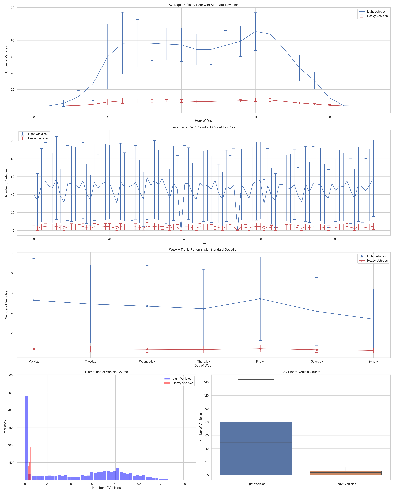

# IoT Data Analysis for Industry 4.0

This project focuses on analyzing IoT data from environmental and traffic sensors to predict traffic patterns using machine learning. The system combines real-time data streaming with historical data analysis to provide insights into traffic behavior based on environmental conditions.

## Project Structure

```
IoT-Data-Analysis/
├── data/                      # Data files
│   ├── environ_MS83200MS_nowind_3m-10min.json
│   ├── traffic_raw_siemens_light-veh.json
│   └── traffic_raw_siemens_heavy-veh.json
├── logs/                      # Log files
├── models/                    # Trained models
├── outputs/                   # Generated outputs
│   └── streaming/            # Real-time analysis results
├── src/                      # Source code
│   ├── data_acquisition.py   # Data loading and preprocessing
│   ├── data_processing.py    # Data processing utilities
│   ├── data_analysis.py      # Data analysis and visualization
│   ├── model_training.py     # Model training and evaluation
│   └── mqtt_streaming.py     # Real-time data streaming
└── requirements.txt          # Project dependencies
```

## Data Sources

### Environmental Data
- **Source**: MS83200MS sensor
- **Format**: JSON
- **Variables**:
  - Temperature (°C): Range 1.54°C to 23.20°C
  - Humidity (%): Range 32.01% to 97.32%
  - Radiation (W/m²): Range 6.04 to 240.73
  - Pressure (hPa): Range 999.27 to 1036.47
  - Sunshine (minutes): Range 0.00 to 599.55
  - Precipitation (mm): Range 0.00 to 0.23

### Traffic Data
- **Source**: Siemens sensors
- **Format**: JSON
- **Categories**:
  - Light vehicles:
    - Mean: 46.06 vehicles
    - Range: 0 to 144 vehicles
    - Zero values: 2303 instances
  - Heavy vehicles:
    - Mean: 3.60 vehicles
    - Range: 0 to 12 vehicles
    - Zero values: 2873 instances
- **Metrics**:
  - Vehicle count per 10-minute interval
  - Timestamp-based measurements
  - 90 days of data (September to November 2018)

## Features

### Data Processing
- Time-based feature engineering
- Environmental interaction features
- Rolling window statistics
- Data cleaning and normalization

### Model Training
- Random Forest Classifier
- Hyperparameter tuning with GridSearchCV
- Cross-validation
- Feature importance analysis

## Visualizations and Insights

### 1. Traffic Pattern Analysis
```
outputs/streaming/traffic_patterns.png
```


- **Hourly Patterns**: Shows peak traffic hours and daily variations
- **Daily Patterns**: Reveals weekday vs weekend traffic differences
- **Weekly Patterns**: Displays traffic distribution across days of the week
- **Distribution Analysis**: 
  - Light vehicles show higher variability (std: 38.84)
  - Heavy vehicles have more consistent patterns (std: 3.20)
- **Box Plots**: Visualizes the statistical distribution of vehicle counts

### 2. Environmental Analysis
```
outputs/streaming/environmental_time_series.png
```


- **Daily Trends**: Shows daily variations in environmental conditions
- **Variable Ranges**:
  - Temperature: 1.54°C to 23.20°C (avg std: 3.14)
  - Humidity: 32.01% to 97.32% (avg std: 13.28)
  - Pressure: 999.27 to 1036.47 hPa (avg std: 2.09)
  - Radiation: 6.04 to 240.73 W/m² (avg std: 170.58)
  - Sunshine: 0.00 to 599.55 minutes (avg std: 189.95)
  - Precipitation: 0.00 to 0.23 mm (avg std: 0.02)

### 3. Environmental Correlations
```
outputs/streaming/environmental_correlations.png
```


- **Strong Correlations**:
  - Humidity vs Temperature: -0.63
  - Radiation vs Sunshine: 0.74
  - Humidity vs Radiation: -0.58
- **Weak Correlations**:
  - Pressure vs Temperature: -0.14
  - Precipitation vs Temperature: -0.04
  - Pressure vs Radiation: 0.03

### 4. Traffic-Environment Relationships
```
outputs/streaming/traffic_vs_environment.png
```


- **Temperature Impact**:
  - Light vehicles: 0.254 correlation
  - Heavy vehicles: 0.255 correlation
- **Humidity Impact**:
  - Light vehicles: -0.365 correlation
  - Heavy vehicles: -0.365 correlation
- **Precipitation Impact**:
  - Light vehicles: -0.021 correlation
  - Heavy vehicles: -0.024 correlation
- **Pressure Impact**:
  - Light vehicles: -0.083 correlation
  - Heavy vehicles: -0.081 correlation

## Key Insights

1. **Traffic Patterns**:
   - Light vehicles show much higher variability than heavy vehicles
   - Both vehicle types follow similar daily and weekly patterns
   - Significant number of zero values in both vehicle types

2. **Environmental Factors**:
   - Temperature and humidity show strong negative correlation
   - Radiation and sunshine are strongly positively correlated
   - Pressure shows minimal correlation with other variables

3. **Traffic-Environment Relationships**:
   - Temperature has a moderate positive impact on traffic
   - Humidity has a moderate negative impact on traffic
   - Precipitation and pressure have minimal impact on traffic patterns

4. **Data Quality**:
   - Environmental data shows consistent sampling (10-minute intervals)
   - Traffic data has complete coverage for the 90-day period
   - Both datasets show reasonable ranges and distributions

## Usage

1. Install dependencies:
   ```bash
   pip install -r requirements.txt
   ```

2. Run data analysis:
   ```bash
   python src/data_analysis.py
   ```

3. Generate visualizations:
   ```bash
   python src/data_visualization.py
   ```

4. Train model:
   ```bash
   python src/model_training.py
   ```

## Future Improvements

1. **Data Analysis**:
   - Implement anomaly detection
   - Add more sophisticated time series analysis
   - Include weather forecast integration

2. **Model Enhancement**:
   - Experiment with deep learning models
   - Add real-time prediction capabilities
   - Implement ensemble methods

3. **Visualization**:
   - Create interactive dashboards
   - Add real-time monitoring capabilities
   - Implement geospatial visualization

## IoT Data Visualization

### Real-time Data Streams
The system processes and visualizes IoT data in real-time, providing comprehensive insights into traffic and environmental patterns.

#### Traffic Analysis Visualizations
1. **Traffic Patterns**
   ```
   outputs/streaming/traffic_patterns.png
   ```
   
   - Combined analysis of light and heavy vehicles
   - Daily traffic patterns
   - Traffic distribution by vehicle type
   - Peak hours identification

#### Environmental Analysis Visualizations
1. **Environmental Time Series**
   ```
   outputs/streaming/environmental_time_series.png
   ```
   
   - Temperature trends
   - Humidity patterns
   - Radiation levels
   - Pressure variations
   - Sunshine duration
   - Precipitation data

2. **Environmental Patterns**
   ```
   outputs/streaming/environmental_patterns.png
   ```
   
   - Daily environmental patterns
   - Seasonal variations
   - Weather trends

3. **Environmental Correlations**
   ```
   outputs/streaming/environmental_correlations.png
   ```
   
   - Correlation heatmap between environmental variables
   - Statistical relationships
   - Dependency analysis

#### Combined Analysis
1. **Traffic-Environment Relationship**
   ```
   outputs/streaming/traffic_vs_environment.png
   ```
   
   - Impact of weather on traffic
   - Environmental influence on vehicle flow
   - Combined pattern analysis

### Understanding IoT Data
IoT (Internet of Things) data in this project represents:
1. **Sensor Measurements**
   - Real-time environmental readings
   - Continuous traffic monitoring
   - Time-stamped data points

2. **Data Patterns**
   - Daily cycles in traffic
   - Weather-related variations
   - Seasonal trends

3. **Predictive Insights**
   - Traffic prediction based on weather
   - Pattern recognition
   - Anomaly detection

## Installation

1. Clone the repository:
```bash
git clone https://github.com/yourusername/IoT-Data-Analysis.git
cd IoT-Data-Analysis
```

2. Create a virtual environment:
```bash
python -m venv venv
source venv/bin/activate  # On Windows: venv\Scripts\activate
```

3. Install dependencies:
```bash
pip install -r requirements.txt
```

## Outputs

The system generates several types of outputs:

1. **Model Files**
   - Trained model (`.pkl`)
   - Model metadata (`.json`)
   - Feature importance plots
   - ROC curves

2. **Analysis Results**
   - Traffic pattern visualizations
   - Environmental correlation plots
   - Statistical summaries

3. **Logs**
   - Training progress
   - Model performance metrics
   - Error tracking

## Dependencies

- Python 3.8+
- pandas
- numpy
- scikit-learn
- matplotlib
- seaborn
- paho-mqtt
- pathlib
- logging

## Contributing

1. Fork the repository
2. Create a feature branch
3. Commit your changes
4. Push to the branch
5. Create a Pull Request

## License

This project is licensed under the MIT License - see the LICENSE file for details.

## Acknowledgments

- Siemens for traffic data
- MS83200MS sensor for environmental data
- Open-source community for libraries and tools

## Advanced Analysis Features

### 1. Time Series Analysis
```
outputs/advanced_analysis/time_series_*.png
```


- **Stationarity Analysis**:
  - Augmented Dickey-Fuller test for trend detection
  - Rolling statistics visualization
  - Multiple seasonal pattern analysis
- **Components**:
  - Original time series
  - Trend component
  - Seasonal component
  - Residual component
- **Key Features**:
  - 24-hour and weekly seasonal patterns
  - Rolling mean and standard deviation
  - Anomaly detection markers

### 2. Anomaly Detection
```
outputs/advanced_analysis/anomaly_detection_*.png
```


- **Isolation Forest Algorithm**:
  - Detects unusual patterns in traffic and environmental data
  - Anomaly scoring system
  - Visual identification of outliers
- **Key Features**:
  - Automatic contamination level adjustment
  - Multi-variable anomaly detection
  - Anomaly score visualization
  - Outlier impact analysis

### 3. Cross-Correlation Analysis
```
outputs/advanced_analysis/cross_correlations.png
```


- **Lag Analysis**:
  - Correlation patterns across different time lags
  - Lead-lag relationships between variables
  - Maximum correlation identification
- **Key Features**:
  - 24-hour lag window
  - Multiple variable comparison
  - Statistical significance indicators
  - Lagged effect visualization

### 4. Seasonal Decomposition
```
outputs/advanced_analysis/seasonal_decomposition_*.png
```


- **Multiple Seasonal Patterns**:
  - Daily patterns (24-hour cycles)
  - Weekly patterns (168-hour cycles)
  - Trend analysis
- **Key Features**:
  - Additive and multiplicative decomposition
  - Residual analysis
  - Pattern strength indicators
  - Seasonal component visualization

### 5. Statistical Analysis
```
outputs/advanced_analysis/statistical_analysis_*.png
```


- **Distribution Analysis**:
  - Probability density functions
  - Cumulative distribution functions
  - Statistical tests
- **Key Features**:
  - Normality tests
  - Skewness and kurtosis analysis
  - Confidence intervals
  - Hypothesis testing

## Advanced Analysis Usage

1. Install dependencies:
   ```bash
   pip install -r requirements.txt
   ```

2. Run advanced analysis:
   ```bash
   python src/advanced_analysis.py
   ```

3. View generated visualizations in:
   ```
   outputs/advanced_analysis/
   ```

## Advanced Analysis Insights

1. **Time Series Patterns**:
   - Strong daily and weekly seasonality in traffic data
   - Environmental variables show clear diurnal patterns
   - Trend components reveal long-term changes
   - Stationarity analysis shows data characteristics

2. **Anomaly Detection**:
   - Identifies unusual traffic patterns
   - Detects environmental sensor anomalies
   - Helps in data quality assessment
   - Provides outlier impact analysis

3. **Cross-Correlation**:
   - Reveals delayed effects of weather on traffic
   - Identifies optimal prediction windows
   - Shows complex inter-variable relationships
   - Highlights lagged dependencies

4. **Seasonal Analysis**:
   - Quantifies seasonal pattern strength
   - Separates trend from seasonal effects
   - Helps in forecasting model selection
   - Shows multiple seasonal components

5. **Statistical Insights**:
   - Reveals data distribution characteristics
   - Identifies non-normal patterns
   - Provides confidence in analysis
   - Supports hypothesis testing
